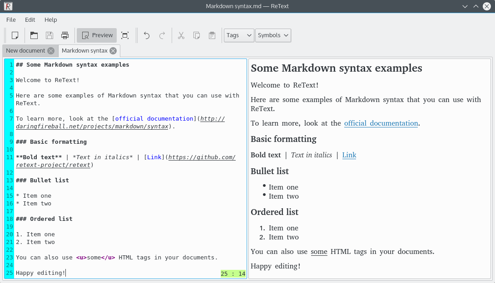

Welcome to ReText!
==================

[![GitHub Actions status][GitHub Actions SVG]][GitHub Actions]

ReText is a simple but powerful editor for Markdown and reStructuredText markup
languages. One can also add support for [custom markups] using Python modules.

To install ReText, make sure that you have [Python] (3.6 or later) installed,
and run `pip3 install ReText`. By default it installs system wide, pass
`--user` for installing into the user’s home directory. You can also manually
download the tarball from [PyPI].

ReText requires the following Python modules to run (`pip` will install them
automatically):

* [PyQt5](https://riverbankcomputing.com/software/pyqt/intro) (5.11 or later)
* [Markups](https://pypi.org/project/Markups/) (2.0 or later)
* [Markdown](https://pypi.org/project/Markdown/) — for Markdown support
* [docutils](https://pypi.org/project/docutils/) — for reStructuredText support

We also recommend having these packages installed:

* [pyenchant](https://pypi.org/project/pyenchant/) — for spell checking support
* [PyQtWebEngine](https://pypi.org/project/PyQtWebEngine/) — a more powerful
  preview engine with JavaScript support

Translation files are already compiled for release tarballs and will be
automatically loaded. For development snapshots, compile translations using
`lrelease ReText/locale/*.ts` command (on Debian-based systems, `lrelease` is
available in `qttools5-dev-tools` package). Translation files can also be
loaded from `/usr/share/retext/` directory.

You can translate ReText into your language on [Transifex].

ReText is Copyright 2011–2021 [Dmitry Shachnev](https://mitya57.me),
2011–2017 [Maurice van der Pot](mailto:griffon26@kfk4ever.com), and is
licensed under GNU GPL (v2+) license, the current version is available in
`LICENSE_GPL` file.

ReText icon is based on `accessories-text-editor` icon from the Faenza theme.

You can read more about ReText in the [wiki].

[wiki]: https://github.com/retext-project/retext/wiki
[PyPI]: https://pypi.org/project/ReText/
[Transifex]: https://www.transifex.com/mitya57/ReText/
[GitHub Actions]: https://github.com/retext-project/retext/actions
[GitHub Actions SVG]: https://github.com/retext-project/retext/workflows/tests/badge.svg
[custom markups]: https://pymarkups.readthedocs.io/en/latest/custom_markups.html
[Python]: https://www.python.org/
